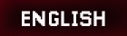

  <!-- Adaptive Header Banner -->
  <picture>
    <source media="(prefers-color-scheme: dark)" srcset="./images/head.jpg">
    <source media="(prefers-color-scheme: light)" srcset="./images/head_light.jpg">
    
  </picture>

  <!-- Adaptive Language Switcher Buttons (Fixed to btn_eng) -->
  <picture>
    <source media="(prefers-color-scheme: dark)" srcset="./images/btn_eng_active.png">
    <source media="(prefers-color-scheme: light)" srcset="./images/btn_eng_light_active.png">
    
  </picture>
  <a href="./README.ru.md">
    <picture>
      <source media="(prefers-color-scheme: dark)" srcset="./images/btn_ru_inactive.png">
      <source media="(prefers-color-scheme: light)" srcset="./images/btn_ru_light_inactive.png">
      
    </picture>
  </a>

---

### 🗂️ Story Behind The Code

✨ **Blending Logic with Creativity**
I am a **Fundamental Computer Science & IT** student at South Ural State University. My academic journey is driven by a passion for teaching machines to see and building worlds from scratch. I bridge the gap between complex algorithms and human-centered design.

* 🤖 **Computer Vision Enthusiast:** Exploring pixels, training models, and finding patterns in visual data.
* 🕹️ **Game Designer & Visionary:** Crafting gameplay mechanics, balance, and immersive interactive experiences.
* 🎨 **UI/UX Architect:** Designing interfaces that are not just beautiful, but completely intuitive and user-focused.

---

### 🎨 Creative Escape & Lifestyle

When I step away from the compiler, I dive into other forms of art and focus:
* ✍️ **The Written Word:** Author of books and poetry, exploring storytelling in every medium.
* 🖌️ **Visual Focus:** Bringing detail to life through paint-by-numbers artwork.
* 🏓 **Active Motion:** Recharging my energy and reflexes with fast-paced table tennis.

---

### 📋 Here is a Short Example
If you would like to take a quick look at my project presentation and reports, you can browse through the full version using the GitHub built-in file viewer:
👉 **[Open Project Presentation (Reports.pdf)](./images/Reports.pdf)**

---

### 🛠️ Tech Stack

<!-- Custom palette badges (Background: 44444E, Text: D3DAD9) -->

  
  
  
  
  

---

### 📊 My GitHub Stats

  
  

  

---

### 🤝 Connect With Me

  
  

