

  <!-- Адаптивный баннер-шапка -->
  <picture>
    <source media="(prefers-color-scheme: dark)" srcset="./images/head.jpg">
    <source media="(prefers-color-scheme: light)" srcset="./images/head_light.jpg">
    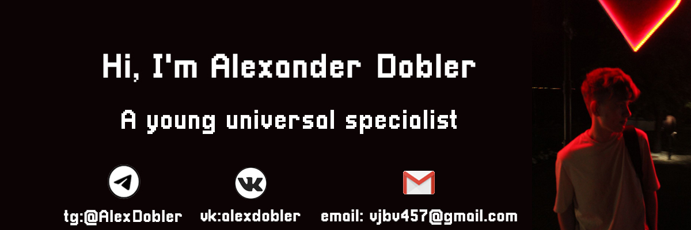
  </picture>

  <!-- Адаптивные кнопки переключения языка -->
  <a href="./README.md">
    <picture>
      <source media="(prefers-color-scheme: dark)" srcset="./images/btn_eng_inactive.png">
      <source media="(prefers-color-scheme: light)" srcset="./images/btn_eng_light.png">
      
    </picture>
  </a>
  <picture>
    <source media="(prefers-color-scheme: dark)" srcset="./images/btn_ru_active.png">
    <source media="(prefers-color-scheme: light)" srcset="./images/btn_ru_light_active.png">
    
  </picture>

---

### (⌐■_■) Статус : свободный агент 

---

### 🗂️ Обо мне
Мне 21 год, я студент направления «Фундаментальная информатика и информационные технологии» в Южно-Уральском государственном университете. В ходе своего обучения овладел многими навыками как хард так и софт. На данный момент базируюсь больше как геймдизайнер, но как обычно получается приходится выполнять и другие задачи. Одновременно геймдеву интересуюсь компьютерным зрением в применение Physical AI.

* 🤖 **Энтузиаст компьютерного зрения:** Исследую пиксели, обучаю модели и нахожу паттерны в визуальных данных.
* 🕹️ **Геймдизайнер и визионер:** Разрабатываю игровые механики, баланс и захватывающий интерактивный опыт.
* 🎨 **UI/UX архитектор:** Проектирую интерфейсы, которые не просто красивы, но абсолютно интуитивны для пользователя.

---

### 🎨 Творчество и увлечения

Когда я отхожу от компилятора, я погружаюсь в другие формы искусства и фокуса:
* ✍️ **Словесное творчество:** Автор книг и стихов, исследую сторителлинг в любых проявлениях.
* 🖌️ **Визуальный фокус:** Переношу детали в жизнь через раскрашивание картин по номерам.
* 🏓 **Активное движение:** Перезагружаю энергию и развиваю рефлексы в динамичном настольном теннисе.

  <table align="center" style="border-collapse: collapse; border: none; width: 100%;">
    <tr>
      <td width="24%" align="center" style="border: none; padding: 4px;">
        
      </td>
      <td width="24%" align="center" style="border: none; padding: 4px;">
        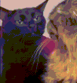
      </td>
      <td width="24%" align="center" style="border: none; padding: 4px;">
        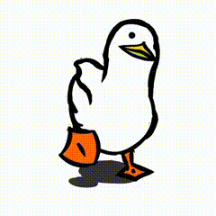
      </td>
      <td width="24%" align="center" style="border: none; padding: 4px;">
        
      </td>
    </tr>
  </table>

### 📋 Вот вам маленький пример
Если вы хотите взглянуть на мои отчеты и презентации проектов, вы можете полистать полную версию во встроенном плеере GitHub:
👉 **[Открыть презентацию проекта (Reports.pdf)](./images/Reports.pdf)**

### 🎬 Портфолио видеомонтажа

  <table align="center" style="border-collapse: collapse; border: none; width: 100%;">
    <tr>
      <!-- Video 1 -->
      <td width="48%" align="center" style="border: none; padding: 8px;">
        <a href="https://youtu.be/niFY24YwdZw" target="_blank">
          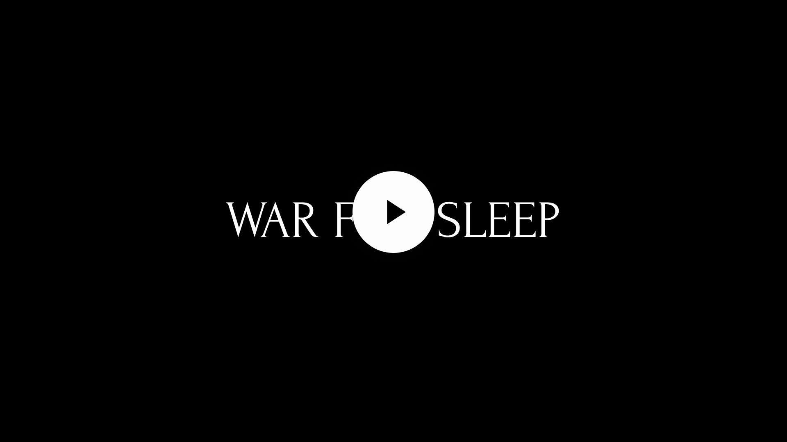
        </a>
      </td>
      <!-- Video 2 -->
      <td width="48%" align="center" style="border: none; padding: 8px;">
        <a href="https://youtu.be/5IEiQ7mbegQ" target="_blank">
          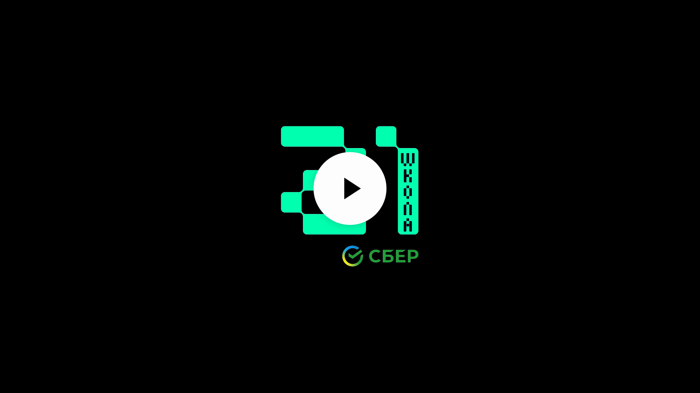
        </a>
      </td>
    </tr>
    <tr>
      <!-- Video 3 -->
      <td width="48%" align="center" style="border: none; padding: 8px;">
        
      </td>
      <!-- Video 4 -->
      <td width="48%" align="center" style="border: none; padding: 8px;">
        <a href="https://youtu.be/MP0YPZDQhWY" target="_blank">
          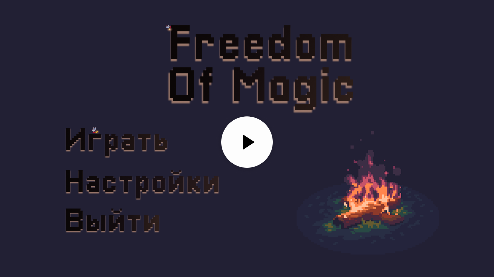
        </a>
      </td>
    </tr>
  </table>

  🍿 <b>[Открыть весь плейлист на YouTube](https://www.youtube.com/playlist?list=PL33UrWCC6MQW8I87wKkrsOIWUVyFr9Zx0)</b>

---

### 🛠️ Стек технологий

#### 💻 Языки программирования

  
  
  
  <picture>
    <source media="(prefers-color-scheme: dark)" srcset="./images/svg_logo/Python-Dark.svg">
    <source media="(prefers-color-scheme: light)" srcset="./images/svg_logo/Python-Light.svg">
    
  </picture>
  
  
  <picture>
    <source media="(prefers-color-scheme: dark)" srcset="./images/svg_logo/Java-Dark.svg">
    <source media="(prefers-color-scheme: light)" srcset="./images/svg_logo/Java-Light.svg">
    
  </picture>
  <picture>
    <source media="(prefers-color-scheme: dark)" srcset="./images/svg_logo/Kotlin-Dark.svg">
    <source media="(prefers-color-scheme: light)" srcset="./images/svg_logo/Kotlin-Light.svg">
    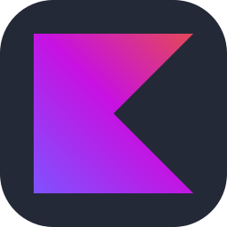
  </picture>
  
  <picture>
    <source media="(prefers-color-scheme: dark)" srcset="./images/svg_logo/PHP-Dark.svg">
    <source media="(prefers-color-scheme: light)" srcset="./images/svg_logo/PHP-Light.svg">
    
  </picture>

#### 🤖 Компьютерное зрение и ИИ / Data Science

  <picture>
    <source media="(prefers-color-scheme: dark)" srcset="./images/svg_logo/OpenCV-Dark.svg">
    <source media="(prefers-color-scheme: light)" srcset="./images/svg_logo/OpenCV-Light.svg">
    
  </picture>
  <picture>
    <source media="(prefers-color-scheme: dark)" srcset="./images/svg_logo/PyTorch-Dark.svg">
    <source media="(prefers-color-scheme: light)" srcset="./images/svg_logo/PyTorch-Light.svg">
    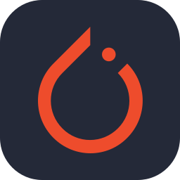
  </picture>
  <picture>
    <source media="(prefers-color-scheme: dark)" srcset="./images/svg_logo/Matlab-Dark.svg">
    <source media="(prefers-color-scheme: light)" srcset="./images/svg_logo/Matlab-Light.svg">
    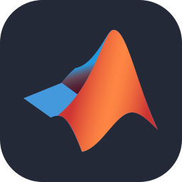
  </picture>

#### 🕹️ Геймдизайн, игровые движки и Пиксель-арт

  <picture>
    <source media="(prefers-color-scheme: dark)" srcset="./images/svg_logo/Unity-Dark.svg">
    <source media="(prefers-color-scheme: light)" srcset="./images/svg_logo/Unity-Light.svg">
    
  </picture>
  
  <picture>
    <source media="(prefers-color-scheme: dark)" srcset="./images/svg_logo/Godot-Dark.svg">
    <source media="(prefers-color-scheme: light)" srcset="./images/svg_logo/Godot-Light.svg">
    
  </picture>
  

#### 🎨 UI/UX и инструменты графического дизайна

  <picture>
    <source media="(prefers-color-scheme: dark)" srcset="./images/svg_logo/Figma-Dark.svg">
    <source media="(prefers-color-scheme: light)" srcset="./images/svg_logo/Figma-Light.svg">
    
  </picture>
  
  
  <picture>
    <source media="(prefers-color-scheme: dark)" srcset="./images/svg_logo/Blender-Dark.svg">
    <source media="(prefers-color-scheme: light)" srcset="./images/svg_logo/Blender-Light.svg">
    
  </picture>

#### 🧠 ИИ-ассистенты и умные редакторы

  
  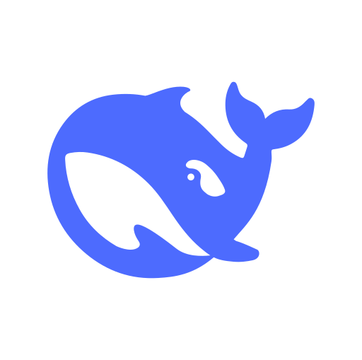
  
  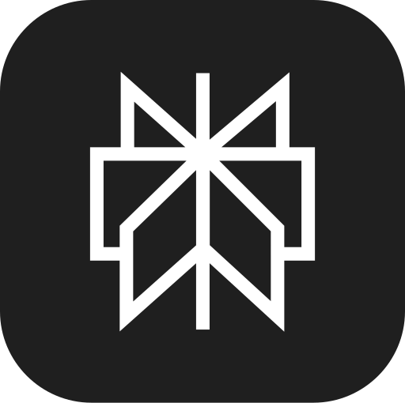
  
  

#### 🎬 Видео, аудио и стриминг производство

  
  
  
  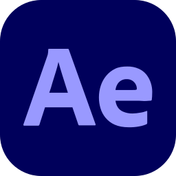

#### 🌐 Веб-разработка и базы данных

  
  
  
  
  
  <picture>
    <source media="(prefers-color-scheme: dark)" srcset="./images/svg_logo/MySQL-Dark.svg">
    <source media="(prefers-color-scheme: light)" srcset="./images/svg_logo/MySQL-Light.svg">
    
  </picture>
  <picture>
    <source media="(prefers-color-scheme: dark)" srcset="./images/svg_logo/PostgreSQL-Dark.svg">
    <source media="(prefers-color-scheme: light)" srcset="./images/svg_logo/PostgreSQL-Light.svg">
    
  </picture>
  

#### 🛠️ Операционные системы и командные оболочки

  
  <picture>
    <source media="(prefers-color-scheme: dark)" srcset="./images/svg_logo/Linux-Dark.svg">
    <source media="(prefers-color-scheme: light)" srcset="./images/svg_logo/Linux-Light.svg">
    
  </picture>
  <picture>
    <source media="(prefers-color-scheme: dark)" srcset="./images/svg_logo/Ubuntu-Dark.svg">
    <source media="(prefers-color-scheme: light)" srcset="./images/svg_logo/Ubuntu-Light.svg">
    
  </picture>
  <picture>
    <source media="(prefers-color-scheme: dark)" srcset="./images/svg_logo/Mint-Dark.svg">
    <source media="(prefers-color-scheme: light)" srcset="./images/svg_logo/Mint-Light.svg">
    
  </picture>
  <picture>
    <source media="(prefers-color-scheme: dark)" srcset="./images/svg_logo/Windows-Dark.svg">
    <source media="(prefers-color-scheme: light)" srcset="./images/svg_logo/Windows-Light.svg">
    
  </picture>
  <picture>
    <source media="(prefers-color-scheme: dark)" srcset="./images/svg_logo/Bash-Dark.svg">
    <source media="(prefers-color-scheme: light)" srcset="./images/svg_logo/Bash-Light.svg">
    
  </picture>
  <picture>
    <source media="(prefers-color-scheme: dark)" srcset="./images/svg_logo/Powershell-Dark.svg">
    <source media="(prefers-color-scheme: light)" srcset="./images/svg_logo/Powershell-Light.svg">
    
  </picture>

#### 🧰 Инструменты разработки и рабочее пространство

  <picture>
    <source media="(prefers-color-scheme: dark)" srcset="./images/svg_logo/VSCode-Dark.svg">
    <source media="(prefers-color-scheme: light)" srcset="./images/svg_logo/VSCode-Light.svg">
    
  </picture>
  <picture>
    <source media="(prefers-color-scheme: dark)" srcset="./images/svg_logo/VisualStudio-Dark.svg">
    <source media="(prefers-color-scheme: light)" srcset="./images/svg_logo/VisualStudio-Light.svg">
    
  </picture>
  <picture>
    <source media="(prefers-color-scheme: dark)" srcset="./images/svg_logo/PyCharm-Dark.svg">
    <source media="(prefers-color-scheme: light)" srcset="./images/svg_logo/PyCharm-Light.svg">
    
  </picture>
  <picture>
    <source media="(prefers-color-scheme: dark)" srcset="./images/svg_logo/Idea-Dark.svg">
    <source media="(prefers-color-scheme: light)" srcset="./images/svg_logo/Idea-Light.svg">
    
  </picture>
  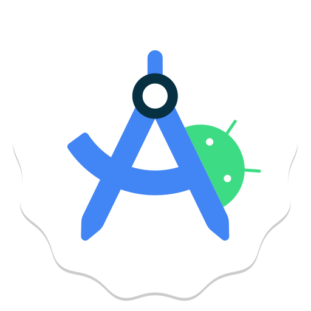
  <picture>
    <source media="(prefers-color-scheme: dark)" srcset="./images/svg_logo/Replit-Dark.svg">
    <source media="(prefers-color-scheme: light)" srcset="./images/svg_logo/Replit-Light.svg">
    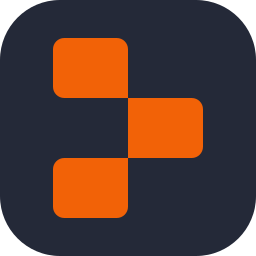
  </picture>
  <picture>
    <source media="(prefers-color-scheme: dark)" srcset="./images/svg_logo/Gradle-Dark.svg">
    <source media="(prefers-color-scheme: light)" srcset="./images/svg_logo/Gradle-Light.svg">
    
  </picture>
  <picture>
    <source media="(prefers-color-scheme: dark)" srcset="./images/svg_logo/Notion-Dark.svg">
    <source media="(prefers-color-scheme: light)" srcset="./images/svg_logo/Notion-Light.svg">
    
  </picture>
  <picture>
    <source media="(prefers-color-scheme: dark)" srcset="./images/svg_logo/LaTeX-Dark.svg">
    <source media="(prefers-color-scheme: light)" srcset="./images/svg_logo/LaTeX-Light.svg">
    
  </picture>

---

### 🤝 Как со мной связаться

  
  <a href="mailto:vjbv457@gmail.com">
    <picture>
      <source media="(prefers-color-scheme: dark)" srcset="./images/svg_logo/Gmail-Dark.svg">
      <source media="(prefers-color-scheme: light)" srcset="./images/svg_logo/Gmail-Light.svg">
      
    </picture>
  </a>
  
  
  
  
  <picture>
    <source media="(prefers-color-scheme: dark)" srcset="./images/svg_logo/Spotify-Dark.svg">
    <source media="(prefers-color-scheme: light)" srcset="./images/svg_logo/Spotify-Light.svg">
    
  </picture>
  <picture>
    <source media="(prefers-color-scheme: dark)" srcset="./images/svg_logo/StackOverflow-Dark.svg">
    <source media="(prefers-color-scheme: light)" srcset="./images/svg_logo/StackOverflow-Light.svg">
    
  </picture>
  <picture>
    <source media="(prefers-color-scheme: dark)" srcset="./images/svg_logo/Github-Dark.svg">
    <source media="(prefers-color-scheme: light)" srcset="./images/svg_logo/Github-Light.svg">
    
  </picture>
  <picture>
    <source media="(prefers-color-scheme: dark)" srcset="./images/svg_logo/GitLab-Dark.svg">
    <source media="(prefers-color-scheme: light)" srcset="./images/svg_logo/GitLab-Light.svg">
    
  </picture>

